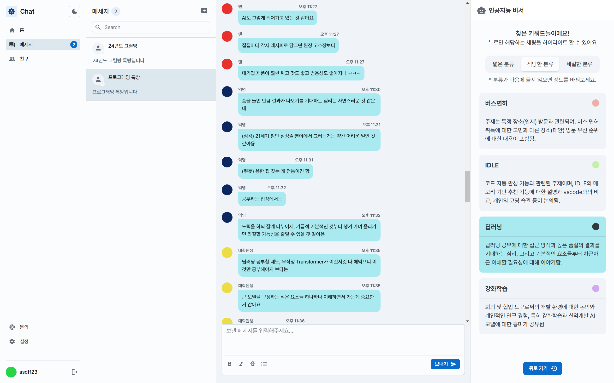

# AI Chat - Frontend

2024 1학기 시작 졸업프로젝트 - **자동으로 맥락을 찾고 분류해주는 AI 채팅앱**



### 사용 기술

- React 18
- yarn
- vite
- typescript
- zustand
- MUI
- socket.io

### 실행 방법

> ⚠️ yarn 이 설치되어 있어야 합니다.

1. 본 레포지토리를 clone 받습니다.
2. 루트 디렉토리에 `.env` 파일을 생성하고, 다음과 같은 내용으로 저장합니다.

```text
VITE_SERVER_URL = <서버 주소>
VITE_SOCK_URL = <서버 소켓 주소>
```

3. `yarn` 을 입력하여 필요한 모듈을 받습니다.
4. `yarn dev` 를 이용하여 dev 서버를 실행시킵니다.
5. (벡엔드 서버를 구동합니다)
